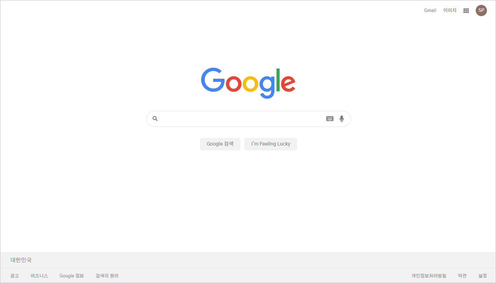

# Google Homepage Clone

👉[See the final version of a google hompage clone](https://coodingpenguin.github.io/google-homepage-clone/)👈

This repository was created when I was in `Web Programming Study`. But at that time, I was not good at using html and css. Just after finishing [Kakao Clone Challenge](https://github.com/CoodingPenguin/kakao-clone-public), I gained confidence and challeged again to cloning google homepage.

**The result is as follow:**

